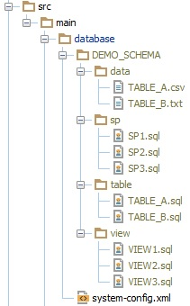

# Obevo -

   

## Database Deployment Tool for Enterprise Scale and Complexity

Deploying tables for a new application?

Or looking to improve the DB Deployment of a years-old system with hundreds (or thousands) of tables, views, stored procedures, and other objects?

Obevo has your use case covered

### Organized maintenance of all your DB-object files

Write 1 file per DB object in your source code to make
By allowing your DB files to be maintained per DB object (as you would with classes in application code), db file maintenance
becomes much easier compared to DB Deployment tools that require a new file or change definition per migration:

* Changes for a particular table can be reviewed in one place
* Stateless objects like stored procedures and views can be edited in place without specifying any new incremental change files
* All of this is possible without having to define the complete order of your file deployments; Obevo figures it out for you (a la a Java compiler compiling classes)

[Click here](https://goldmansachs.github.io/obevo/design-walkthrough.html) for more information on how Obevo works and how its algorithm compares to what most other DB Deployment tools do

### In-memory and integration testing

How do you test your DDLs before deploying to production?

Obevo provides utilities and build plugins to clean and rebuild your databases so that you can integrate that step into
your integration testing lifecycle.

Obevo can take that a step further by converting your DB table and view code into an [in-memory database compatible format](https://goldmansachs.github.io/obevo/in-memory-db-testing.html)
that you can use in your tests. The conversion is done at runtime, so you do not have to maintain separate DDLs
just for in-memory testing

### Easy onboarding of existing systems

Hesitant about getting your existing database schema under SDLC control due to how objects your application has built up
over the years? Obevo has been vetted against many such cases from applications in large enterprises.

### Versatile to run

Obevo can be invoked via:
* [Java API](https://goldmansachs.github.io/obevo/java-api.html)
* [Command Line API](https://goldmansachs.github.io/obevo/command-line-api.html)
* [Maven](https://goldmansachs.github.io/obevo/maven-api.html)
* [Gradle](https://goldmansachs.github.io/obevo/gradle-api.html)

Obevo is designed to allow your DB code to be packaged and deployed alongside your application binaries.

Treat your DB code like you would treat your application code!

### DBMS-specific features

Obevo currently supports DB2, Sybase ASE, Sybase IQ, PostgreSQL, MS SQL Server, Oracle, HSQLDB, and H2

It has special handling for DBMS, such as reorgs for DB2 and handling transaction log checks for Sybase ASE

## Sample Project
To help getting started with Obevo, a simple project is available with maven and gradle build set-up.

https://github.com/goldmansachs/obevo-kata

## Quick Links

* [Documentation](https://goldmansachs.github.io/obevo/)
* [Java API](https://goldmansachs.github.io/obevo/java-api.html)
* [Command Line API](https://goldmansachs.github.io/obevo/command-line-api.html)
* [Maven](https://goldmansachs.github.io/obevo/maven-api.html)
* [Gradle](https://goldmansachs.github.io/obevo/gradle-api.html)

## Acquiring Obevo

* [Versions] (https://github.com/goldmansachs/obevo/releases)
* [Maven Central] (http://search.maven.org/#search%7Cga%7C1%7Cg%3A%22com.goldmansachs.obevo-dist%22)
